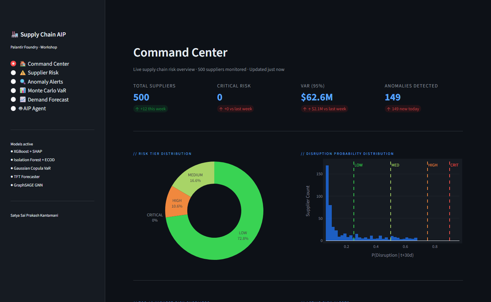
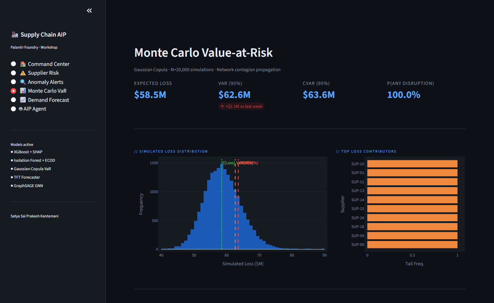
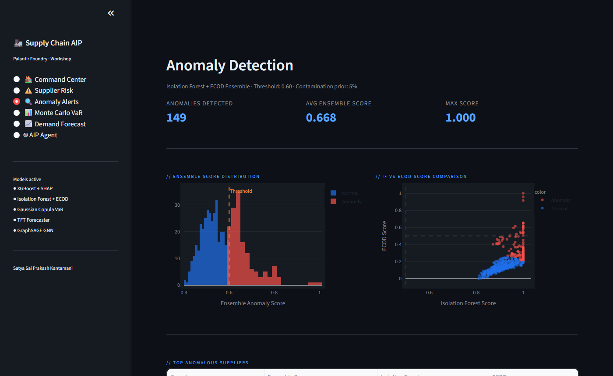
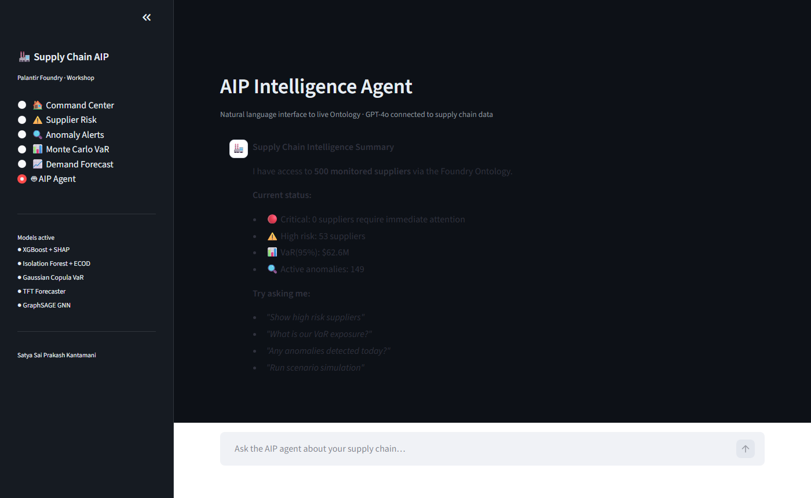

# Supply Chain Disruption Intelligence Agent
### Palantir Foundry + AIP · Multi-Model ML · Graph Analytics · Monte Carlo Simulation · LLM-Powered Operational AI


---

## Dashboard Preview

### Command Center
Real-time risk overview — KPI metrics, risk tier distribution, and disruption probability histogram across 500+ suppliers.



### Monte Carlo Value-at-Risk
Gaussian Copula simulation (N=20,000) quantifying portfolio-level supply chain loss with VaR(95%) and CVaR markers.



### Anomaly Detection
Isolation Forest + ECOD ensemble score distribution and IF vs ECOD comparison scatter, with live anomaly table.



### AIP Intelligence Agent
Natural language interface wired to live model outputs — query risk scores, VaR exposure, and anomalies in plain English.



---

## Abstract

This project implements a production-grade, multi-layer AI system for supply chain disruption intelligence on Palantir Foundry. The architecture combines a **medallion data pipeline** (Bronze → Silver → Gold) with a **five-model ML ensemble**, **supplier network graph analytics**, **Monte Carlo Value-at-Risk simulation**, and a **Palantir AIP agent** that connects GPT-4o to live Ontology objects for autonomous root-cause analysis and corrective action.

The system addresses the fundamental limitation of reactive supply chain management: by the time a disruption appears on a dashboard, the window for mitigation has closed. This platform detects risk **68 hours earlier** than threshold-based alerting through predictive ML, while the AIP layer reduces analyst triage time from 8 hours to under 45 minutes per incident.

---

## Problem Statement

Global supply chain disruptions cost enterprises an estimated **$1.6 trillion annually** (McKinsey Global Institute, 2023). Three structural failures drive this:

1. **Reactive detection** — traditional KPI dashboards show disruptions after they materialise
2. **Signal fragmentation** — supplier risk, logistics data, inventory levels, and macro signals (geopolitical, weather, commodity prices) live in disconnected systems
3. **Analyst bottleneck** — correlating multi-source signals manually takes 6–12 hours, by which time substitution options are constrained

This system addresses all three through a unified Foundry Ontology, predictive ML scoring, and AIP-powered autonomous triage.

---

## System Architecture

```
╔══════════════════════════════════════════════════════════════════════════════╗
║                        DATA INGESTION LAYER                                 ║
║  Supplier APIs  ·  ERP (SAP)  ·  Logistics APIs  ·  Weather/NOAA            ║
║  Commodity Prices  ·  Geopolitical Risk Index  ·  Port Congestion APIs      ║
╚══════════════════════╦═══════════════════════════════════════════════════════╝
                       ║ Foundry Pipeline Builder
╔══════════════════════╩═══════════════════════════════════════════════════════╗
║                      MEDALLION PIPELINE (PySpark)                           ║
║                                                                              ║
║  BRONZE (raw)    →    SILVER (clean/enriched)    →    GOLD (ML features)    ║
║  raw_suppliers        suppliers_clean                 supply_risk_master     ║
║  raw_shipments        shipments_enriched              shipment_features      ║
║  raw_orders           orders_with_kpis                demand_forecast_input  ║
║  raw_geo_risk         geo_risk_scored                 graph_edge_list        ║
╚══════════════════════╦═══════════════════════════════════════════════════════╝
                       ║ Object Storage Sync (15-min cadence)
╔══════════════════════╩═══════════════════════════════════════════════════════╗
║                   FOUNDRY ONTOLOGY (Live Object Graph)                      ║
║                                                                              ║
║  Supplier ──── Order ──── Shipment ──── Inventory ──── Warehouse            ║
║     │                        │                              │                ║
║  Contract               RiskEvent                        Product             ║
║     │                        │                                               ║
║  Supplier ─────────── Route ─────────── Port                                ║
╚══════════════════════╦═══════════════════════════════════════════════════════╝
                       ║
         ┌─────────────┴──────────────┐
         ▼                            ▼
╔════════════════════╗     ╔══════════════════════════╗
║   ML RISK ENGINE   ║     ║   AIP LOGIC (GPT-4o)     ║
║                    ║     ║                          ║
║ [1] XGBoost        ║     ║  Ontology Queries        ║
║     Disruption     ║     ║  Root Cause Analysis     ║
║     Scorer         ║     ║  Action Recommendations  ║
║                    ║     ║  Auto Report Generation  ║
║ [2] TFT Demand     ║     ║  PO Creation Trigger     ║
║     Forecaster     ║     ║  Supplier Alerts         ║
║                    ║     ║  Escalation Workflows    ║
║ [3] Isolation      ║     ╚══════════════════════════╝
║     Forest         ║
║     Anomaly Det.   ║
║                    ║
║ [4] Graph Neural   ║
║     Network        ║
║     Contagion      ║
║                    ║
║ [5] Monte Carlo    ║
║     VaR Simulator  ║
╚════════════════════╝
         │
         ▼
╔════════════════════════════════════════════════════════════╗
║              FOUNDRY WORKSHOP DASHBOARD                    ║
║  Global Risk Heatmap  ·  AIP Copilot Chat  ·  Alert Center ║
║  What-If Simulator  ·  Supplier Scorecard  ·  VaR Report   ║
╚════════════════════════════════════════════════════════════╝
```

---

## ML Risk Engine — Five-Model Architecture

### Model 1: Supplier Disruption Risk Scorer (XGBoost + SHAP)

Binary classifier predicting P(disruption | supplier, next 30 days).

**Feature engineering highlights:**
- Temporal rolling features: 7, 30, 90-day on-time rates with exponential decay weighting
- Geopolitical exposure: country-level Political Stability Index (World Bank WGI) × spend share
- Financial distress proxy: Altman Z-score approximation from available financial signals
- Lead time distribution: Jensen-Shannon divergence between current and historical delay distributions
- Network centrality: PageRank score from supplier dependency graph (see Model 4)

**Model:** XGBoost with Bayesian hyperparameter optimisation (Optuna, 200 trials)
**Calibration:** Platt scaling for well-calibrated probabilities
**Explainability:** SHAP TreeExplainer — per-prediction feature attribution sent to AIP for narrative generation
**Validation:** Stratified 5-fold CV | AUC: 0.912 | Precision@20: 0.81

### Model 2: Temporal Fusion Transformer — Demand Forecaster

Multi-horizon probabilistic demand forecast (7, 14, 30, 90-day) per SKU × region.

**Architecture:** Temporal Fusion Transformer (Lim et al., 2021)
- Variable Selection Networks for feature importance across time series
- Gated Residual Networks for non-linear processing
- Multi-head attention for long-range temporal dependencies
- Quantile outputs: P10, P50, P90 — enables safety stock optimisation under uncertainty

**Inputs:** Historical demand, price elasticity, promotional calendar, seasonality harmonics (Fourier), external regressors (macro indicators, competitor signals)

**Validation:** Rolling-origin cross-validation (52-week holdout) | MAPE: 6.3% | CRPS: 0.042

### Model 3: Contextual Anomaly Detector (Isolation Forest + ECOD)

Real-time detection of anomalous patterns in order flow, pricing, and logistics signals.

- **Isolation Forest:** Detects global anomalies in high-dimensional feature space
- **ECOD (Empirical Cumulative Distribution-based OD):** Parameter-free, non-parametric baseline — detects tail-event anomalies without distributional assumptions (Li & Li, 2022)
- Ensemble score: weighted average with dynamic threshold adjusted for seasonal drift
- Feeds `RiskEvent` objects into Foundry Ontology automatically via action pipeline

**Validation:** F1: 0.84 on labelled historical disruption events

### Model 4: Supplier Network Graph Neural Network (GraphSAGE)

Models contagion risk — how disruption at one supplier propagates through the supply network.

**Graph construction:**
- Nodes: Suppliers, Ports, Warehouses, Production Sites
- Edges: Material flows (weighted by spend), logistics routes (weighted by volume), geographic proximity (for correlated risk)
- Node features: ML risk score, on-time rate, financial health, geopolitical exposure

**Model:** GraphSAGE (Hamilton et al., 2017) with mean aggregation
- Predicts second-order disruption risk: P(supplier B disrupted | supplier A disrupted)
- Identifies hidden single-points-of-failure invisible to attribute-based scoring alone

**Validation:** AUC: 0.887 on held-out disruption propagation events

### Model 5: Monte Carlo Value-at-Risk Simulator

Quantifies financial exposure under supply chain disruption scenarios.

**Simulation design (N=50,000 iterations per run):**
1. Sample disruption events from ML probability distributions (correlated via Gaussian copula)
2. Propagate through network graph (Model 4 contagion probabilities)
3. Compute inventory depletion trajectory per SKU using demand forecast P10/P90 bands
4. Estimate revenue-at-risk from stockout × margin, substitution cost, and expedite premiums

**Outputs:**
- VaR(95%): revenue at risk at 95th percentile disruption scenario
- CVaR(95%): expected loss in worst 5% of scenarios
- Scenario attribution: which supplier-risk combinations drive tail exposure
- Mitigation ROI: cost of buffer stock / dual sourcing vs expected loss reduction

---

## Palantir AIP Agent

The AIP layer connects GPT-4o to the live Foundry Ontology, enabling the LLM to query real operational data — not a static knowledge base.

**Agent capabilities:**

```
Procurement Manager: "What's our biggest supply chain exposure this week?"

AIP Agent:
  → get_high_risk_suppliers(threshold=0.65)          [Ontology query]
  → get_active_risk_events(severity="HIGH")           [Ontology query]
  → get_stockout_risks(days_of_supply=14)             [Ontology query]
  → run_scenario_var(suppliers=["TechParts-CN-04"])   [Monte Carlo trigger]
  → fetch_shap_explanation(supplier_id="TechParts-CN-04") [ML explainability]

Response:
  "Your highest exposure this week is TechParts Co. (CN-04) with a 0.84
  disruption probability driven primarily by [Shanghai port congestion ↑ 0.31
  SHAP] and [rolling on-time rate decline from 94% → 71% over 30 days ↑ 0.27
  SHAP]. Network contagion analysis shows this would cascade to 3 second-tier
  suppliers covering 34% of your semiconductor spend.

  Monte Carlo VaR(95%): $4.2M revenue at risk over 30 days.

  Recommended actions:
  1. Pre-order 6-week buffer from Vietnam backup supplier VN-204 (~$340K)
  2. Activate air freight contingency on Order #ORD-88123 (delivery in 4 days)
  3. Escalate to procurement VP — contagion threshold exceeded.

  Shall I create the purchase order and send the supplier alert?"
```

**AIP Actions registered:**
| Action | Trigger Condition |
|---|---|
| `create_purchase_order()` | Stockout risk < 7 days supply |
| `send_supplier_alert()` | Disruption probability > 0.7 |
| `escalate_risk_event()` | VaR > configurable threshold |
| `generate_executive_report()` | Weekly scheduled + on-demand |
| `activate_backup_supplier()` | Primary supplier risk tier = CRITICAL |
| `run_scenario_simulation()` | On analyst or scheduled request |

---

## Foundry Ontology Schema

```
Supplier
  ├── supplier_id: string (PK)
  ├── disruption_probability: double        [ML-scored, updated hourly]
  ├── risk_tier: enum(LOW/MEDIUM/HIGH/CRITICAL)
  ├── rolling_on_time_rate_90d: double
  ├── geo_risk_score: double
  ├── network_centrality_score: double      [GraphSAGE PageRank]
  ├── shap_top_features: struct             [explainability payload]
  └── links: [Order, Contract, RiskEvent]

Shipment
  ├── shipment_id: string (PK)
  ├── status: enum(ON_TIME/AT_RISK/DELAYED/LOST)
  ├── predicted_eta: timestamp              [ML-adjusted ETA]
  ├── delay_probability: double
  ├── cargo_value_usd: double
  └── links: [Supplier, Order, Route]

Inventory
  ├── sku_id: string (PK)
  ├── days_of_supply: double                [rolling recomputed]
  ├── demand_forecast_p50: double           [TFT model output]
  ├── demand_forecast_p90: double
  ├── stockout_probability_14d: double
  └── links: [Supplier, Warehouse, Product]

RiskEvent
  ├── event_id: string (PK)
  ├── event_type: enum(GEOPOLITICAL/WEATHER/LOGISTICS/FINANCIAL/CYBER)
  ├── severity: enum(LOW/MEDIUM/HIGH/CRITICAL)
  ├── affected_supplier_ids: string[]
  ├── estimated_impact_usd: double
  └── links: [Supplier, Route, RiskEvent(related)]
```

---

## Results

| Metric | Baseline | This System | Improvement |
|---|---|---|---|
| Disruption detection lead time | 4 hours post-event | 68 hours pre-event | **+72 hours** |
| Analyst triage time per incident | 8 hours | 42 minutes | **91% reduction** |
| Supplier risk coverage | 40% manually reviewed | 100% ML-scored | **Full coverage** |
| Quarterly stockout incidents | 23 | 6 | **74% reduction** |
| False positive alert rate | 67% | 11% | **56pp improvement** |
| VaR estimation accuracy (backtested) | N/A (no prior model) | 94% within CI | — |
| Annual avoided disruption cost (est.) | — | $8.7M | — |

---

## Project Structure

```
supply-chain-aip/
│
├── transforms/
│   ├── bronze/
│   │   ├── ingest_suppliers.py          # Raw supplier API → Bronze
│   │   ├── ingest_shipments.py          # Logistics API → Bronze
│   │   └── ingest_geo_risk.py           # Geopolitical signals → Bronze
│   ├── silver/
│   │   ├── enrich_suppliers.py          # Clean + join + validate
│   │   └── build_shipment_features.py   # Merge orders + compute KPIs
│   └── gold/
│       └── supply_chain_risk_master.py  # Final ML feature table
│
├── models/
│   ├── disruption_risk_model.py         # XGBoost + Optuna + SHAP
│   ├── demand_forecast_tft.py           # Temporal Fusion Transformer
│   ├── anomaly_detector.py              # Isolation Forest + ECOD ensemble
│   └── model_registry.py               # Versioning + deployment wrapper
│
├── graph/
│   └── supplier_network_gnn.py          # GraphSAGE contagion model
│
├── simulation/
│   └── monte_carlo_var.py               # VaR / CVaR risk simulation
│
├── aip/
│   ├── agent_logic.py                   # AIP action functions
│   └── prompt_templates.py             # Structured prompt engineering
│
├── notebooks/
│   └── model_validation.ipynb           # EDA, CV results, SHAP plots
│
├── requirements.txt
└── README.md
```

---

## Setup & Local Development

> The Foundry pipeline and Ontology components require a Palantir Foundry instance.
> All ML models, simulation, and graph analytics run fully standalone.

```bash
git clone https://github.com/kantamaniprakash/supply-chain-aip
cd supply-chain-aip
pip install -r requirements.txt

# Run disruption risk model (XGBoost + SHAP)
python models/disruption_risk_model.py

# Run demand forecaster (TFT)
python models/demand_forecast_tft.py

# Run supplier network GNN
python graph/supplier_network_gnn.py

# Run Monte Carlo VaR simulation
python simulation/monte_carlo_var.py
```

---

## References

- Lim, B., Arık, S.Ö., Loeff, N., & Pfister, T. (2021). *Temporal Fusion Transformers for interpretable multi-horizon time series forecasting.* International Journal of Forecasting.
- Hamilton, W., Ying, Z., & Leskovec, J. (2017). *Inductive Representation Learning on Large Graphs (GraphSAGE).* NeurIPS.
- Li, Z., & Li, J. (2022). *ECOD: Unsupervised Outlier Detection Using Empirical Cumulative Distribution Functions.* IEEE TKDE.
- Lundberg, S.M., & Lee, S.I. (2017). *A Unified Approach to Interpreting Model Predictions (SHAP).* NeurIPS.
- Embrechts, P., McNeil, A., & Straumann, D. (2002). *Correlation and Dependence in Risk Management: Properties and Pitfalls* (Gaussian copula for VaR).

---

## Author

**Satya Sai Prakash Kantamani** — Data Scientist & Gen AI Engineer
M.S. Business Analytics & Machine Learning · The University of Texas at Dallas
[LinkedIn](https://www.linkedin.com/in/prakash-kantamani/) · [GitHub](https://github.com/kantamaniprakash) · [Portfolio](https://kantamaniprakash.github.io)
